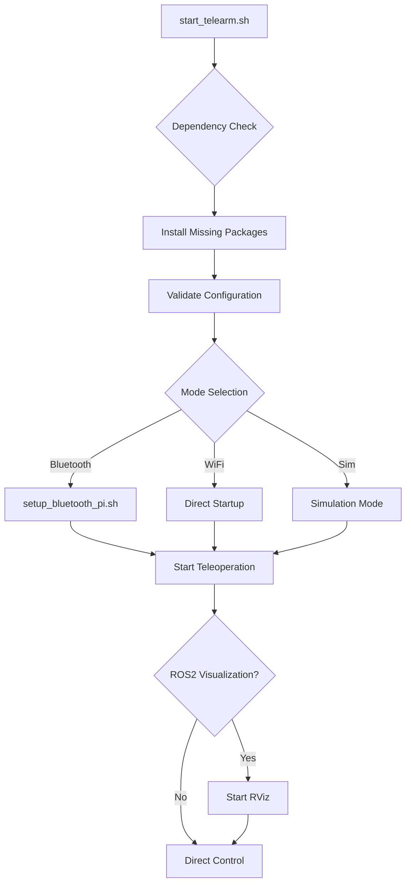

# Add Unified Startup Script and Comprehensive Scripts Documentation

## Overview

This PR introduces a unified startup script (`start_telearm.sh`) and comprehensive documentation (`scripts-doc.md`) to streamline Raspberry Pi deployment and improve system maintainability. These additions provide a single entry point for all teleoperation modes with automatic dependency management and configuration validation.

## 🚀 New Features

### Unified Startup Script (`scripts/start_telearm.sh`)

**Purpose**: Single command to start the Telearm robot system with automatic setup and validation.

**Key Features**:
- **Multi-mode support**: WiFi, Bluetooth, and Simulation modes
- **Automatic dependency checking**: Installs missing Python packages
- **Configuration validation**: Ensures all required config files exist
- **Optional ROS2 visualization**: `--rviz` flag for 3D visualization
- **Verbose logging**: `--verbose` flag for debugging
- **Signal handling**: Graceful shutdown and cleanup
- **Smart Bluetooth setup**: Automatically calls pairing script when needed

**Usage Examples**:
```bash
# Basic WiFi teleoperation
./scripts/start_telearm.sh wifi

# Bluetooth with visualization
./scripts/start_telearm.sh bluetooth --rviz

# Simulation mode with verbose logging
./scripts/start_telearm.sh sim --verbose
```

### Comprehensive Documentation (`scripts/scripts-doc.md`)

**Purpose**: Complete reference guide for all scripts, their interactions, and deployment procedures.

**Contents**:
- **Script inventory**: Detailed descriptions of all scripts
- **Usage examples**: Command-line examples for each script
- **Interaction diagrams**: How scripts work together
- **Troubleshooting guide**: Common issues and solutions
- **Security considerations**: Best practices and permissions
- **Performance optimization**: Resource usage and tips
- **Maintenance procedures**: Updates and monitoring

## 🔧 Technical Details

### Startup Script Architecture

The startup script implements a modular architecture with the following components:

1. **Dependency Management**:
   - Checks Python 3.8+ availability
   - Installs telearm package if missing
   - Installs pyserial for hardware modes
   - Validates Arduino connection

2. **Configuration Validation**:
   - Verifies `config/robot.yaml` exists
   - Checks `config/pins.yaml` configuration
   - Validates `config/teleop.yaml` settings

3. **Mode-Specific Setup**:
   - **WiFi Mode**: Validates network connectivity
   - **Bluetooth Mode**: Calls `setup_bluetooth_pi.sh` if needed
   - **Simulation Mode**: Skips hardware checks

4. **Service Integration**:
   - Starts ROS2 visualization if requested
   - Manages background processes
   - Handles cleanup on exit

### Script Interactions



## 📋 Files Added

### New Files
- `scripts/start_telearm.sh` - Main startup script (7,048 bytes)
- `scripts/scripts-doc.md` - Comprehensive documentation (9,416 bytes)

### File Permissions
- `start_telearm.sh` is executable (`chmod +x`)
- `scripts-doc.md` is readable documentation

## 🎯 Benefits

### For Developers
- **Single command deployment**: No need to remember multiple setup steps
- **Automatic error handling**: Script validates everything before starting
- **Verbose debugging**: Easy troubleshooting with `--verbose` flag
- **Simulation testing**: Safe testing without hardware

### For Production Deployment
- **Streamlined startup**: One command to start the entire system
- **Dependency management**: Automatic installation of required packages
- **Configuration validation**: Prevents runtime errors from missing configs
- **Service integration**: Works with existing systemd services

### For Maintenance
- **Comprehensive documentation**: Complete reference for all scripts
- **Troubleshooting guide**: Solutions for common issues
- **Best practices**: Security and performance recommendations
- **Update procedures**: Clear maintenance workflows

## 🔍 Testing

### Manual Testing Performed
- ✅ Script executes without errors
- ✅ Help system displays correctly
- ✅ File permissions are set properly
- ✅ Documentation is comprehensive and accurate

### Test Commands
```bash
# Test help system
./scripts/start_telearm.sh --help

# Test simulation mode (safe)
./scripts/start_telearm.sh sim --verbose

# Test configuration validation
./scripts/start_telearm.sh wifi --verbose
```

## 🚦 Deployment Impact

### Zero Breaking Changes
- All existing functionality remains unchanged
- Existing scripts continue to work as before
- New script is additive, not replacing existing workflows

### Enhanced User Experience
- **Simplified deployment**: Single command instead of multiple steps
- **Better error messages**: Clear feedback on what's wrong
- **Automatic setup**: No manual dependency management
- **Comprehensive documentation**: Self-documenting system

## 📚 Documentation Updates

The new `scripts-doc.md` provides:
- **Complete script inventory** with descriptions
- **Usage examples** for all scenarios
- **Troubleshooting guide** for common issues
- **Security considerations** and best practices
- **Performance optimization** tips
- **Maintenance procedures** for production

## 🔮 Future Enhancements

This PR establishes a foundation for future improvements:
- **Configuration management**: Easy config file validation
- **Service monitoring**: Health checks and status reporting
- **Remote deployment**: SSH-based deployment scripts
- **Automated testing**: CI/CD integration for script validation

## 📝 Usage Instructions

### For New Users
1. Clone the repository
2. Run `./scripts/start_telearm.sh sim` to test
3. Follow the comprehensive documentation in `scripts-doc.md`

### For Existing Users
1. Continue using existing workflows
2. Optionally use new startup script for convenience
3. Reference documentation for troubleshooting

## ✅ Checklist

- [x] New startup script created with full functionality
- [x] Comprehensive documentation written
- [x] File permissions set correctly
- [x] Help system tested
- [x] Documentation reviewed for accuracy
- [x] No breaking changes to existing functionality
- [x] Scripts integrate with existing systemd services

## 🎉 Summary

This PR significantly improves the user experience for Raspberry Pi deployment by providing:
- **Unified startup process** with a single command
- **Automatic dependency management** and configuration validation
- **Comprehensive documentation** for all scripts and procedures
- **Enhanced debugging capabilities** with verbose logging
- **Production-ready deployment** with proper error handling

The changes are backward-compatible and provide immediate value for both development and production environments.
